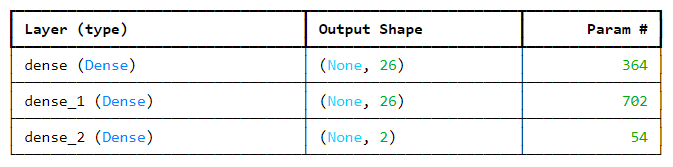

# Bank-Loan-Granting-Deep-Learning

Dataset Link = [BankLoanGrantingDataset](https://www.kaggle.com/datasets/corneliuskarel/bank-loan-granting)

## Objective
<p align="justify">Create a deep learning model that can forecast loan acceptance and boost the interpretability of the model for the main determinants of loan choices, and to achieve high prediction accuracy by optimizing the model's performance.</p>

## Business Opportunities
<p align="justify">Rapid and precise loan eligibility determination is essential in the banking sector. Because manual evaluations can be laborious and inconsistent, an automated model is useful for processing loans quickly. With the use of deep learning, this initiative seeks to forecast loan approval outcomes, giving banks a tool to expedite decision-making and lower risk.</p>

## Methodologies 

### Feature Preprocessing

#### here are a few things that need to be preprocessed first so we can analize it later on like "Zip Code" and "CCAvg"¶
```
#ZIP Code can be derived to find exactly the latitude and longitude coordinate of a subject using pgeocode library

#first, we need to locate where this data is from, i looked on google for country where the zip codes are 5-digit numbers, looks like it is in the United States

#declare the location to browse the zip codes
location = pgeocode.Nominatim('us')

#Create a list to save the latitude & longitude result
lat = []
long = []

#iterate through each row to browse its latitude & longitude value
for row in df['ZIP Code']:
    res = location.query_postal_code(row)
    lat.append(res['latitude'])
    long.append(res['longitude'])

#Append the result to the main dataframe
df['lat'] = pd.DataFrame(lat)
df['lon'] = pd.DataFrame(long)
```

#### Oversampling minority class
```
#oversampling the minority class
sm = SMOTE(random_state = 42)
x_train, y_train = sm.fit_resample(x_train, y_train)
```
#### Data scaling
```
#scaling train set predictors using Robust Scaler
scaler = RobustScaler()
cols = x_train.columns
x_train = pd.DataFrame(scaler.fit_transform(x_train), columns = cols)
x_train.head()
```
#### baseline model & result

```
#creating a base line model which contains (n, 2*n, 2*n, num_class)
def create_baseline_model(n, num_class):
    model = tf.keras.Sequential([
        tf.keras.layers.Dense(2 * n, activation='relu', input_shape=(n,)),
        tf.keras.layers.Dense(2 * n, activation='relu'),
        tf.keras.layers.Dense(num_class, activation='softmax')
    ])
    return model

n = 13  
num_class = 2 

#initialize model
baseline_model = create_baseline_model(n, num_class)
baseline_model.summary()
```
Result <p></p>


#### modified model & result

```
#creating a modified model 
def modified_model(n, num_class):
    modified_model = tf.keras.Sequential([
        tf.keras.layers.Dense(4 * n, activation='relu', input_shape=(n,)),
        tf.keras.layers.Dropout(0.2),  #regularization
        tf.keras.layers.Dense(2 * n, activation='relu'),
        tf.keras.layers.Dropout(0.2),  #regularization
        tf.keras.layers.Dense(2 * n, activation='relu'),
        tf.keras.layers.Dropout(0.2),  #regularization
        tf.keras.layers.Dense(num_class, activation='softmax')
    ])
    return modified_model

#To optimize the model, the complexity is increased to 4 * n units each, while the baseline only have 2 * n units
#Regularization (dropout) is also added to prevent overfitting
#while input remains the same.

n = 13  
num_class = 2 

#initialize model
m_model = modified_model(n, num_class)
m_model.summary()
```
Result<p></p>


## Conclusion
<p align="justify">Overall, the modified model performs slightly below the baseline_model in all aspects, this means that our modified model, one of the possibilities could be due to overfitting, since the modified model were added more layers/neurons, our modified model could be fitting too closely to the training set, making it bad to predict the test set.</p>

